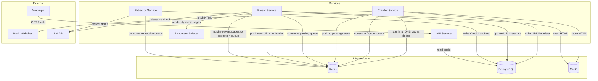
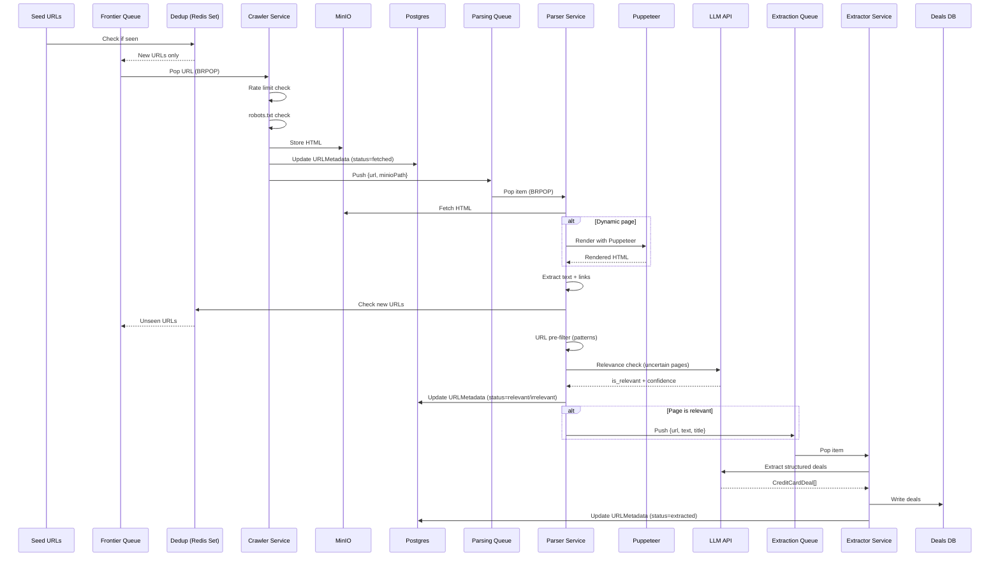
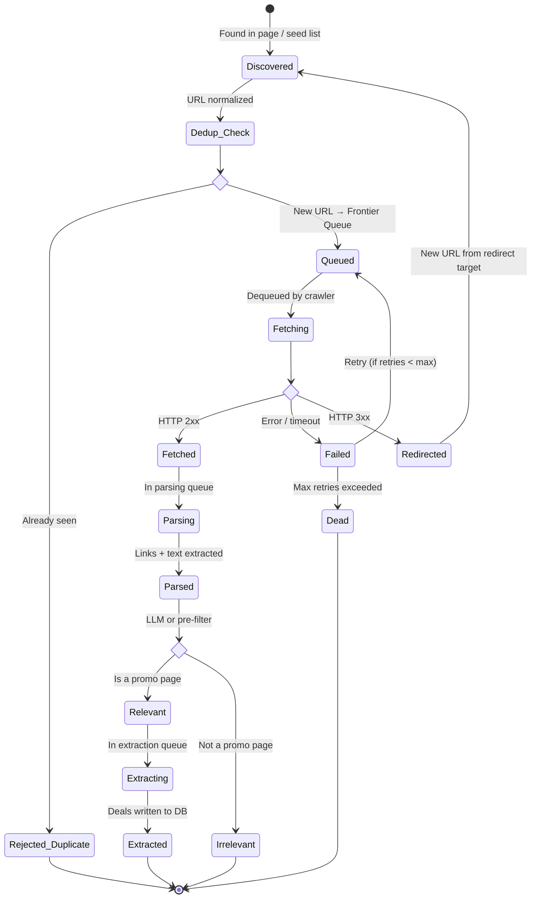
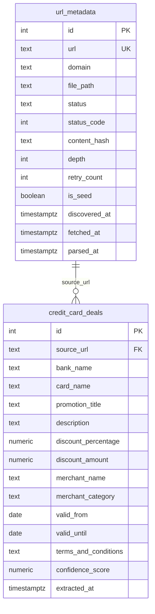

# Card Promotions Crawler — Cartographer Skill

You are the cartographer for the **Card Promotions Data Crawler**, a multi-service system that
crawls bank websites for credit card deals. Your job: map the service topology, design URL discovery
features, and produce clear documentation and diagrams.

## System Context

The system consists of 7 Docker Compose services communicating through Redis queues, with MinIO for
blob storage and Postgres for metadata + extracted deals. An LLM is used for relevance filtering
and structured deal extraction. A Puppeteer sidecar handles JavaScript-rendered pages.

## Three Domains

1. **Service Topology** — How the Docker Compose services connect, what each does, and how data
   flows between them through queues and shared storage.
2. **URL/Site Cartography** — The frontier queue design, URL dedup, link graph, domain boundary
   detection, and crawl scope management.
3. **Documentation & Diagrams** — Producing artifacts that communicate the above clearly.

---

## Domain 1: Service Topology

### Docker Compose Service Map



### Service Responsibilities

| Service | Consumes | Produces | Dependencies |
|---------|----------|----------|--------------|
| **Crawler** | Frontier Queue (Redis) | Raw HTML (MinIO), URLMetadata (Postgres), Parsing Queue items | Redis, MinIO, Postgres |
| **Parser** | Parsing Queue (Redis) | New URLs → Frontier Queue, Relevant pages → Extraction Queue | Redis, MinIO, Postgres, Puppeteer, LLM API |
| **Extractor** | Extraction Queue (Redis) | CreditCardDeal records (Postgres) | Redis, Postgres, LLM API |
| **API** | HTTP requests | JSON responses | Postgres |
| **Puppeteer** | HTTP requests from Parser | Rendered HTML | None (stateless) |

### Redis Key Layout

Redis is used for multiple purposes. Document the key naming convention:

```
Queue keys:
  queue:frontier          — Frontier URL queue (Redis list)
  queue:parsing           — Crawler→Parser handoff (Redis list)
  queue:extraction        — Parser→Extractor handoff (Redis list)
  queue:dead_letter       — Failed messages (Redis list)

Deduplication:
  dedup:seen_urls         — Set of SHA256 hashes of normalized URLs

Rate limiting:
  ratelimit:{domain}      — Sliding window counter per domain (Redis sorted set or string with TTL)

DNS cache:
  dns:{hostname}          — Cached DNS resolution (string with TTL)

Stats:
  stats:fetched_count     — Total pages fetched (counter)
  stats:relevant_count    — Pages marked relevant (counter)
  stats:deals_count       — Deals extracted (counter)
```

### Postgres Schema

Two logical databases (or schemas within one database):

```sql
-- Crawl metadata
CREATE TABLE url_metadata (
    id              SERIAL PRIMARY KEY,
    url             TEXT NOT NULL UNIQUE,
    domain          TEXT NOT NULL,
    file_path       TEXT,                  -- MinIO object path
    status          TEXT NOT NULL DEFAULT 'queued',
    status_code     INTEGER,
    content_hash    TEXT,                  -- SHA256 of page content
    depth           INTEGER DEFAULT 0,
    retry_count     INTEGER DEFAULT 0,
    is_seed         BOOLEAN DEFAULT false,
    error_message   TEXT,
    discovered_at   TIMESTAMPTZ DEFAULT now(),
    fetched_at      TIMESTAMPTZ,
    parsed_at       TIMESTAMPTZ
);

CREATE INDEX idx_url_metadata_domain ON url_metadata(domain);
CREATE INDEX idx_url_metadata_status ON url_metadata(status);

-- Extracted deals
CREATE TABLE credit_card_deals (
    id                   SERIAL PRIMARY KEY,
    source_url           TEXT NOT NULL,
    bank_name            TEXT NOT NULL,
    card_name            TEXT,
    promotion_title      TEXT NOT NULL,
    description          TEXT NOT NULL,
    discount_percentage  NUMERIC(5,2),
    discount_amount      NUMERIC(10,2),
    merchant_name        TEXT,
    merchant_category    TEXT,
    valid_from           DATE,
    valid_until          DATE,
    terms_and_conditions TEXT,
    raw_text             TEXT,
    confidence_score     NUMERIC(3,2),
    extracted_at         TIMESTAMPTZ DEFAULT now()
);

CREATE INDEX idx_deals_bank ON credit_card_deals(bank_name);
CREATE INDEX idx_deals_category ON credit_card_deals(merchant_category);
CREATE INDEX idx_deals_valid_until ON credit_card_deals(valid_until);
```

### MinIO Bucket Layout

```
Bucket: pages
  pages/{domain}/{url_hash}.html     — Raw HTML of crawled pages
  pages/{domain}/{url_hash}.meta     — Optional: response headers, fetch timestamp

Bucket: screenshots (optional, for Puppeteer renders)
  screenshots/{domain}/{url_hash}.png
```

---

## Domain 2: URL/Site Cartography

### Data Flow — The Crawl Lifecycle



### URL State Machine



### Frontier Queue Design

```
Design Decisions:
├── Queue Backend: Redis List (LPUSH/BRPOP)
│   └── Upgrade path: Redis Streams for at-least-once delivery
├── Priority: FIFO by default
│   └── Seed URLs get higher priority (push to front)
│   └── Future: Redis Sorted Set (ZADD/BZPOPMIN) for priority scoring
├── Deduplication: Redis Set of SHA256(normalized_url)
│   └── Upgrade path: RedisBloom for memory efficiency at scale
├── Scope Boundaries:
│   ├── Domain whitelist (only crawl configured bank domains)
│   ├── URL pattern whitelist per domain
│   ├── Max depth from seed URL
│   └── Max URLs per domain
└── Persistence:
    ├── Redis AOF for queue durability (survives restart)
    └── URLMetadata in Postgres as source of truth for crawl state
```

### Domain Boundary Configuration

For a focused crawler targeting bank promotion pages, crawl scope is critical:

```python
# Example domain configuration
CRAWL_DOMAINS = {
    "bank-a.example.com": {
        "seed_urls": [
            "https://bank-a.example.com/promotions",
            "https://bank-a.example.com/credit-cards/offers",
        ],
        "url_patterns": [
            r"^https://bank-a\.example\.com/promotions/.*",
            r"^https://bank-a\.example\.com/credit-cards/.*",
            r"^https://bank-a\.example\.com/offers/.*",
        ],
        "exclude_patterns": [
            r"/careers", r"/investor", r"/login", r"/register",
        ],
        "max_depth": 4,
        "max_urls": 500,
        "needs_puppeteer": False,
    },
    "bank-b.example.com": {
        "seed_urls": ["https://bank-b.example.com/privileges"],
        "url_patterns": [r"^https://bank-b\.example\.com/privileges/.*"],
        "max_depth": 3,
        "max_urls": 300,
        "needs_puppeteer": True,  # This bank uses SPA
    },
}
```

---

## Domain 3: Documentation & Diagrams

### Diagram Types for This System

| Purpose | Diagram Type | When |
|---------|-------------|------|
| Service topology | Mermaid `graph TB` with subgraphs | System overview |
| Data flow | Mermaid `sequenceDiagram` | Trace a URL through the pipeline |
| URL states | Mermaid `stateDiagram-v2` | Document URL lifecycle |
| Docker Compose layout | Mermaid `graph LR` | Infrastructure view |
| Database schema | Mermaid `erDiagram` | Data model documentation |
| Queue message flow | Mermaid `graph LR` | Queue contracts |

### Database ER Diagram



### Queue Message Contracts

Document what each queue carries — this is the API between services:

```
frontier queue:
  FrontierItem { url: str, depth: int, priority: int, source_url: str? }
  Producer: Parser Service (new URLs), Seed loader
  Consumer: Crawler Service

parsing queue:
  ParsingQueueItem { url: str, minio_path: str, depth: int }
  Producer: Crawler Service
  Consumer: Parser Service

extraction queue:
  ExtractionQueueItem { url: str, minio_path: str, text_content: str, page_title: str }
  Producer: Parser Service (relevant pages only)
  Consumer: Extractor Service
```

### Generating the Dependency Map

Use the bundled script to auto-generate a dependency graph from the codebase:

```bash
# Mermaid diagram
python skills/cartographer/scripts/map_dependencies.py services/ --package shared --format mermaid

# JSON for programmatic use
python skills/cartographer/scripts/map_dependencies.py services/ --format json

# Graphviz DOT
python skills/cartographer/scripts/map_dependencies.py services/ --format dot | dot -Tpng -o deps.png
```

### README Structure

```markdown
# Card Promotions Data Crawler

Crawls bank websites for credit card promotions, extracts structured deal data
using LLM, and serves it through an API.

## Architecture
<Link to architecture diagram>

## Quick Start
docker compose up -d
# Seed the frontier queue:
python scripts/seed.py --config seeds.yaml

## Services
<Table: service, port, purpose>

## Configuration
<Environment variables table>

## Development
<How to run tests, add a new bank, modify extraction prompts>
```

### Contributor Guide

Read `references/contributor_guide_template.md` for a full template covering dev setup,
service architecture, how to add a new bank target, how to modify LLM prompts, and
the PR process.

## Workflow

When asked to map, document, or diagram:

1. **Determine scope** — whole system, single service, data flow, or specific feature?
2. **Read the actual code** — check docker-compose.yml, service entry points, shared models.
   Don't guess at what talks to what.
3. **Choose the right diagram** — use the table above to pick the right Mermaid diagram type.
4. **Produce the artifact** — Mermaid diagram, markdown doc, or both.
5. **Verify accuracy** — cross-check diagram against docker-compose.yml and actual imports.
   An inaccurate diagram is worse than none.
