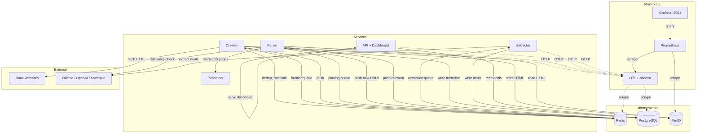

# CRD Promo Crawler

A multi-service pipeline that crawls Sri Lankan bank websites for credit card promotions, extracts structured deal data using LLMs, and serves them through a REST API with a web dashboard.

## Architecture



> Detailed interactive diagram: [docs/diagrams/architecture.excalidraw](docs/diagrams/architecture.excalidraw) (open in [excalidraw.com](https://excalidraw.com))

### Data Flow

```
scripts/seed.py
     |
     v
[frontier queue] --> Crawler --> [parsing queue] --> Parser --> [extraction queue] --> Extractor
                       |              |                |                                  |
                       v              v                v                                  v
                     MinIO        Postgres         Puppeteer                           Postgres
                   (raw HTML)   (url_metadata)   (JS rendering)                   (credit_card_deals)
                                                                                         |
                                                                                         v
                                                                                   API (port 8000)
                                                                                         |
                                                                                         v
                                                                                   Web Dashboard (/)
```

## Services

| Service | Stack | Port | Purpose |
|---------|-------|------|---------|
| **crawler** | Python/asyncio | - | Fetches bank pages via HTTP + Puppeteer, stores HTML in MinIO |
| **parser** | Python/asyncio | - | Parses HTML, extracts links, LLM relevance filtering |
| **extractor** | Python/asyncio | - | LLM-powered structured deal extraction |
| **api** | FastAPI | 8000 | REST API for deals + web dashboard |
| **puppeteer** | Node.js/Express | 3000 | Headless Chrome sidecar for JS-rendered pages |

### Infrastructure

| Service | Port | Purpose |
|---------|------|---------|
| **Redis** | 6379 | Message queues, URL dedup, rate limiting |
| **PostgreSQL** | 5432 | URL metadata, extracted deals |
| **MinIO** | 9000/9001 | Raw HTML blob storage |

### Monitoring

| Service | Port | Purpose |
|---------|------|---------|
| **OpenTelemetry Collector** | 4317/4318 | Receives metrics/traces from all services via OTLP, scrapes Redis & Postgres |
| **Prometheus** | 9090 | Metrics storage, scrapes OTel Collector + MinIO |
| **Grafana** | 3001 | Dashboards (admin/admin) |

## Quick Start

### Prerequisites

- Docker & Docker Compose
- Ollama running locally (or OpenAI/Anthropic API key)

### 1. Configure

```bash
cp .env.example .env
# Edit .env — set LLM_MODEL to an available Ollama model:
#   LLM_MODEL=qwen2.5-coder:14b
```

### 2. Start Services

```bash
docker compose up -d
```

### 3. Run Migrations

```bash
cd migrations && alembic -c alembic.ini upgrade head
```

### 4. Seed the Crawler

Seed the frontier queue from inside the crawler container (Docker Redis):

```bash
docker compose exec crawler python -c "
import asyncio, json, redis.asyncio as r
# ... seed script targeting redis://redis:6379/0
"
```

Or from the host (if no local Redis conflicts on port 6379):

```bash
python3 scripts/seed.py --clear
```

### 5. Monitor

```bash
# Web dashboard
open http://localhost:8000/

# Grafana dashboards (Pipeline Overview + Infrastructure)
open http://localhost:3001/   # admin / admin

# API stats
curl http://localhost:8000/deals/stats

# Service logs
docker compose logs -f crawler parser extractor

# Queue sizes (from Docker Redis)
docker compose exec redis redis-cli llen queue:frontier
docker compose exec redis redis-cli llen queue:parsing
docker compose exec redis redis-cli llen queue:extraction
```

### 6. Export Deals to offerspot

```bash
python3 scripts/export_deals_json.py > deals.json
```

## API Endpoints

| Method | Endpoint | Description |
|--------|----------|-------------|
| GET | `/` | Web dashboard |
| GET | `/deals` | List deals (query: `page`, `per_page`, `bank_name`, `category`, `active_only`) |
| GET | `/deals/stats` | Deal statistics by bank and category |
| GET | `/deals/search?keyword=` | Search deals by keyword |
| GET | `/deals/{id}` | Get single deal |
| GET | `/health` | Health check |

## Bank Coverage

| Bank | Strategy | Puppeteer |
|------|----------|-----------|
| Sampath Bank | infinite_scroll | Yes |
| People's Bank | category_discovery | No |
| Bank of Ceylon | load_more_button | No |
| HSBC | pagination | No |
| Commercial Bank | static | No |
| DFCC Bank | category_discovery | No |

Bank configurations are in `config/banks.json` — seed URLs, URL patterns, CSS selectors, and category mappings.

## Crawler Protection

| Protection | Description |
|------------|-------------|
| URL dedup | SHA256 hash of normalized URLs in Redis set |
| Content dedup | SHA256 hash of page content — skips duplicate content from different URLs |
| URL normalization | Trailing slash, session ID stripping, query param sorting, path normalization |
| URL length limit | Rejects URLs > 2048 characters |
| Path depth limit | Rejects URLs with > 10 path segments |
| Per-domain ceiling | Max 500 URLs per domain (configurable) |
| Crawl depth limit | Max depth 3 from seed URLs |
| Domain restriction | Same-domain only |
| Bank URL patterns | Whitelist regex patterns per bank from config |
| Rate limiting | Per-domain delay (1s default) |
| Response size limit | 10MB max response |
| Redirect limit | Max 5 redirects |
| Exclude patterns | 30 regex patterns for irrelevant paths (/careers, /login, /terms, etc.) |

## Project Structure

```
crd-promo-crawler/
  config/
    banks.json              # Bank seed URLs, selectors, URL patterns
  migrations/
    alembic/                # Database migrations
  scripts/
    seed.py                 # Seed frontier queue
  services/
    api/                    # FastAPI + web dashboard
      api/                  # Python package
      static/               # HTML/CSS/JS dashboard
    crawler/                # URL fetcher
    parser/                 # HTML parser + relevance filter
    extractor/              # LLM deal extraction
    puppeteer/              # Headless Chrome sidecar
  shared/
    shared/                 # Shared library (models, queue, dedup, DB, LLM, telemetry)
  monitoring/
    otel-collector-config.yaml  # OpenTelemetry Collector config
    prometheus.yml              # Prometheus scrape config
    grafana/
      provisioning/             # Datasources + dashboard providers
      dashboards/               # Pipeline Overview + Infrastructure dashboards
  docker-compose.yml
  .env.example
```

## Monitoring

The monitoring stack uses OpenTelemetry for instrumentation with Prometheus + Grafana for visualization.

### Grafana Dashboards

| Dashboard | Panels |
|-----------|--------|
| **Pipeline Overview** | URLs fetched, pages parsed, relevant pages, deals extracted/stored, queue depths, fetch rate/duration, dedup stats, LLM call durations, API request rate/latency |
| **Infrastructure** | Redis (memory, clients, commands/sec, hit rate), PostgreSQL (connections, DB size, row counts, commits/rollbacks), MinIO (objects, storage, request rates, network traffic) |

### Metrics Collected

Each Python service exports metrics to the OTel Collector via OTLP gRPC:

- **Crawler**: `urls_fetched`, `fetch_duration_seconds`, `content_dedup_skipped`, `url_dedup_skipped`, `domain_ceiling_skipped`
- **Parser**: `pages_parsed`, `pages_relevant`, `pages_irrelevant`, `links_discovered`, `prefilter_results`, `llm_call_duration_seconds`
- **Extractor**: `pages_extracted`, `deals_extracted`, `deals_stored`, `deals_duplicates_skipped`, `llm_call_duration_seconds`
- **API**: `api_requests` (by endpoint/method/status), `api_request_duration_seconds`

## LLM Configuration

Supports three providers via environment variables:

| Provider | `LLM_PROVIDER` | `LLM_BASE_URL` | `LLM_API_KEY` |
|----------|-----------------|-----------------|----------------|
| Ollama (default) | `ollama` | `http://host.docker.internal:11434` | not needed |
| OpenAI | `openai` | `https://api.openai.com/v1` | required |
| Anthropic | `anthropic` | (built-in) | required |

## Development

```bash
# Install shared package locally
pip install -e shared/

# Run tests
python3 -m pytest services/*/tests shared/tests -m "not integration and not e2e"

# Lint
ruff check .

# Rebuild specific service
docker compose build api
docker compose up -d api
```

## License

Private project.
